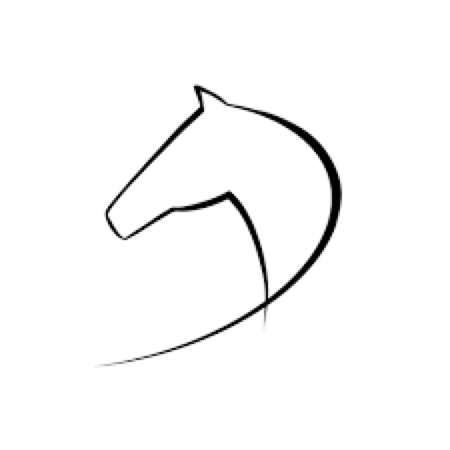

    

<h1 align="center">Bole Design</h1>

  Highly customizability, full TypeScript, tool set for developer.

    

  More components and features are currently under development.

## Features

- 📦 High quality Vue 3 components
- 🔨 With TypeScript, fully types
- 📐 Intuitive, minimalistic Api design
- 🛫 Provide resolver, support unplugin
- ⚡ Composition Api, good performance base
- 👀 Close to business code arrangement, low threshold for source code reading
- 🔧 Configurable default value of props, quickly complete global/local modifications
- 🚤 Support SSR
- 🚩 Support i18n
- 🎨 Support CSS variable, built-in dark theme
- 💪 Support unit tests to provide good stability

## TODO

- [ ] 完善打包构建脚本
- [ ] 基于 `vitest` 为组件添加单元测试
- [ ] 完善组件库 sass 系统,支持覆盖和预设
- [ ] 组件增加自定义前缀功能，全局样式功能
- [ ] 完善 docs，使用`@bole-design/styles`完成
- [x] 增加基于 `vitepress` 的文档，确定目录结构
- [ ] 增加 `dev-serve`，方便 dev 环境开发和测试组件
- [x] 基于 pnpn 的 `monorepo`,`components`,`hooks`,`sass`分包
- [ ] 为开发环境增加 dev-serve,自动读取 docs 中的中英文 demo 文件

## Scripts

- [x] 自动完善组件类型支持
- [ ] packages 模块构建和全量构建
- [x] 打包所有组件，支持 es 和 cjs
- [x] 组件全局的提示，自动生成`index.d.ts`文件
- [ ] 使用 gulp 单独对 sass 文件进行编译和输出
- [ ] 自动生成 docs 模版，自动添加 `markdown` 文件
- [x] 自动读取 index.ts 文件，为所有组件生成`d.ts`文件
- [ ] 根据 props 自动生成 Demo vue 文件 ，生成 params table
- [x] 根据 components 目录自动导出所有组件，并提供 vue use install 函数
